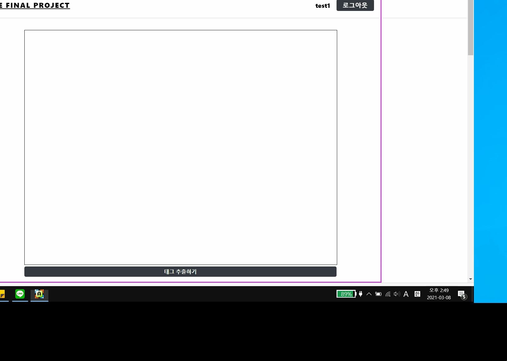
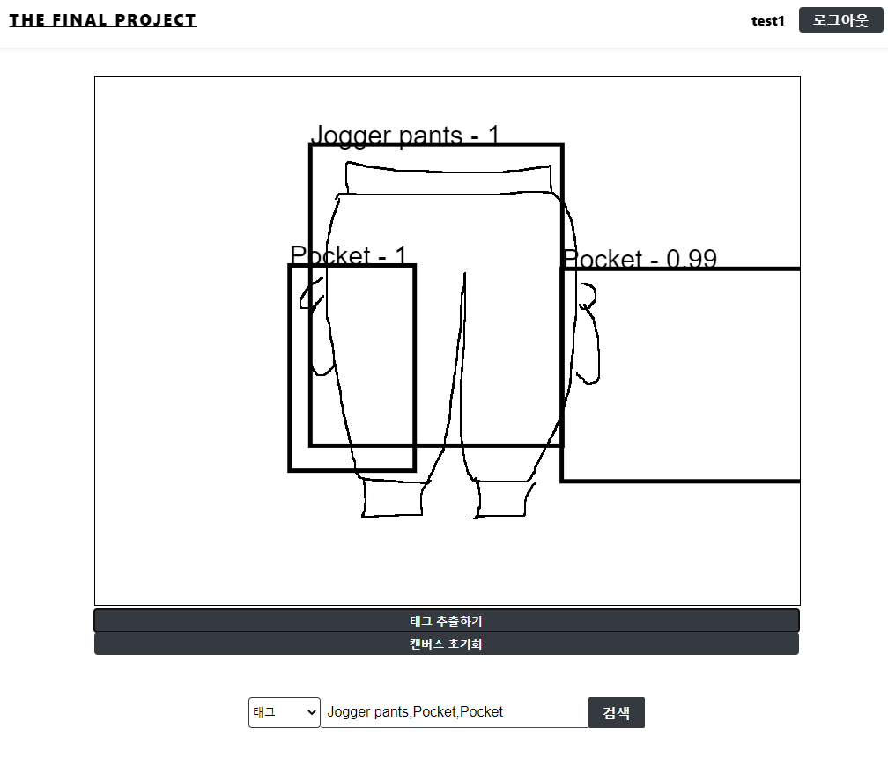
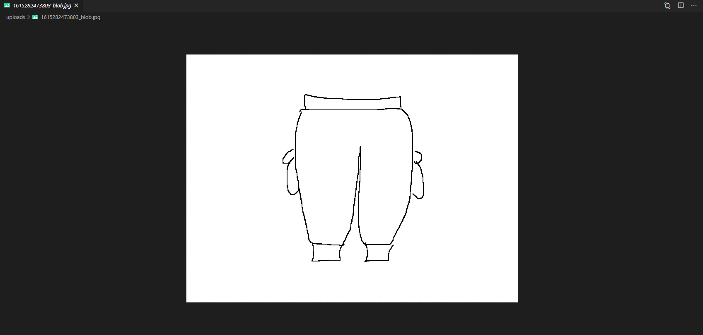

# final_project
졸업작품용 깃허브

tensorflow의 object detection model을 활용하여 웹 상에서 그림을 그리면 그림의 특징을 찾아 그와 유사한 옷을 찾아주는 시스템 입니다.

### 그림속 특징 추출 및 자동완성
</img> 

### 특징 추출 후 그림 데이터 수집
</img>
그림 데이터를 입력하면 객체를 인식하여 아래의 검색창에 추출된 테그를 자동완성 
</img> 
이미지를 자동으로 수집해 줍니다.
